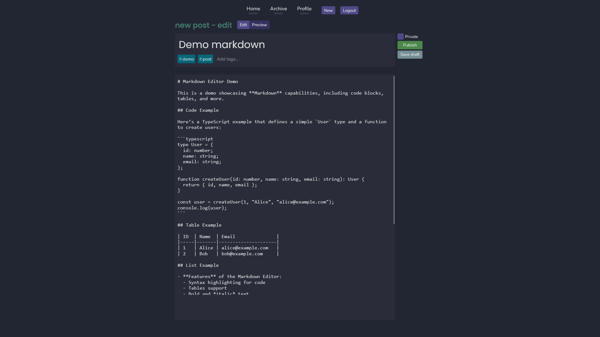
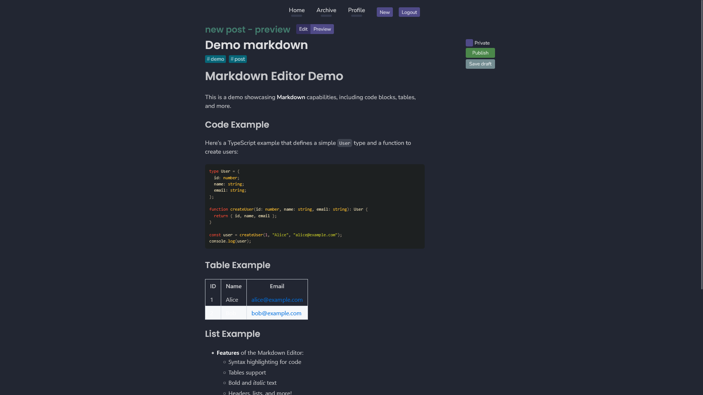

# Blog

> Personal blog website

## Features

- Full markdown editor and preview
- Rate limiting
- Drafts
- Private/Public
- Pagination

## Pictures





**Commands:**

Start frontend and backend in dev mode:

```bash
docker compose -f docker-compose.dev.yml --profile client --profile server up
```

Frontend is at `localhost:3000` and
Backend at `localhost:5000`
