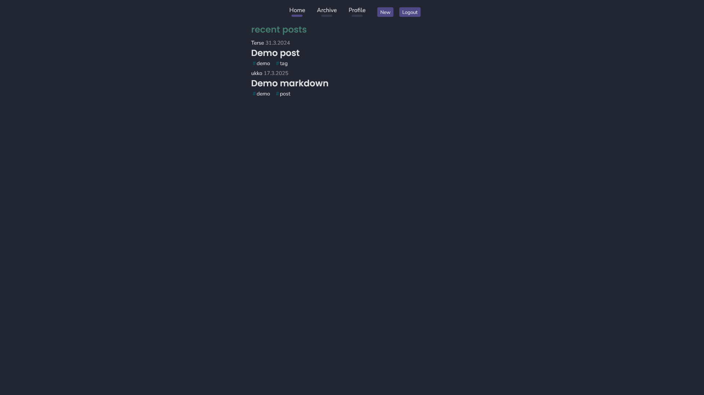

# Blog

> Personal blog website

## Pictures




**Commands:**

Start frontend and backend in dev mode:

```bash
docker compose -f docker-compose.dev.yml --profile client --profile server up
```

Frontend is at `localhost:3000` and
Backend at `localhost:5000`
